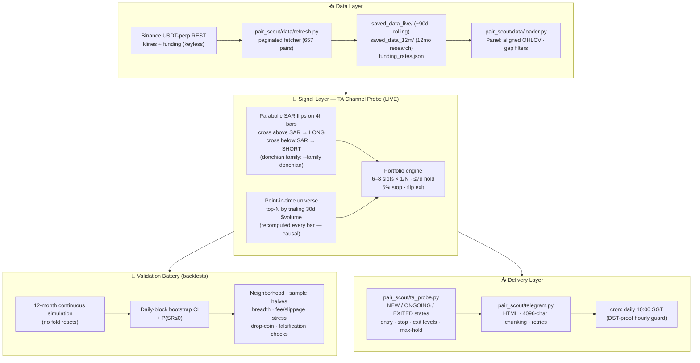
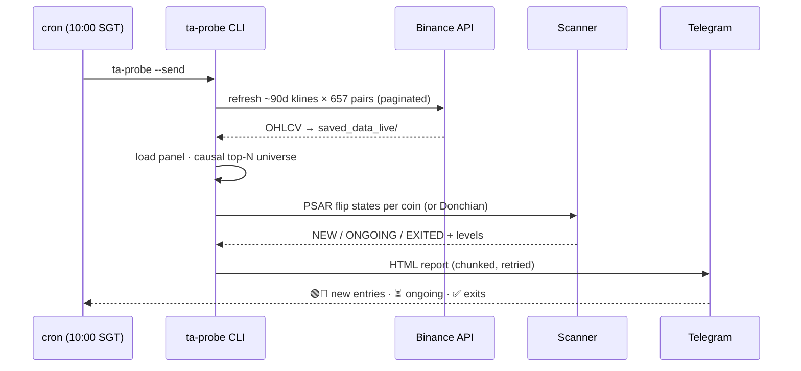
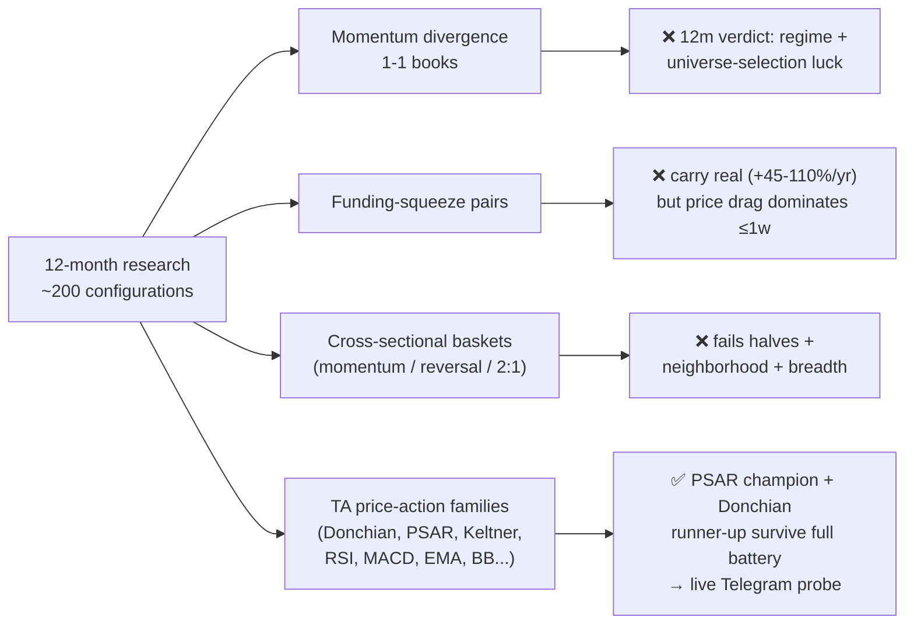

# crypto-pair-trading

> **🏆 Current best strategy: dual-direction Parabolic SAR flip trading** over a
> broad point-in-time universe at slot breadth — live as the **TA Channel Probe**
> (daily Telegram alerts at 10:00 SGT). Jump to
> [Current Best Strategy](#-current-best-strategy--dual-direction-parabolic-sar-flips)
> and [Architecture](#️-architecture--end-to-end-pipeline). Everything else in
> this README documents the research journey — including six strategy families
> that were tested and honestly rejected.

### **Overview**
This repository contains Jupyter notebooks implementing several pair trading strategies designed to minimize risk while maximizing returns. These strategies focus on profiting from relative price movements between cryptocurrencies, leveraging correlations and market dynamics.
<br>
<br>

### Included Strategies
Please look into the respective Jupyter notebook for more explanations and details.

1. **Pairs-Trading (Mean Reversion) Strategy Analysis** (*cointegration-pair-trading.ipynb*)

Pair Trading Mean Reversion strategy is a market-neutral trading strategy that involves simultaneously buying and selling two correlated financial instruments, such as stocks, ETFs, or currencies, to profit from the relative price movement between them.

2. **Pairs-Trading (Negative / Low Correlation) Strategy Analysis** (*correlation-pair-trading.ipynb*)

The negative/low correlation pairs trading strategy involves taking advantage of the performance divergence between two loosely correlated or negatively correlated assets by longing the stronger asset and shorting the weaker one.

3. **Pairs-Trading (Beta Neutral) Strategy Analysis (Auto)** (*beta-neutral-pair-trading-auto.ipynb*)

The beta neutral trading strategy is a market-neutral approach designed to eliminate systematic market risk by constructing a portfolio that has a net beta of zero. This strategy aims to generate alpha (excess returns above the market) by taking both long and short positions in securities such that the overall portfolio is insulated from broad market movements. This notebook uses CVXPY package to optimise portfolio weights given a set of data.

4. **Pairs-Trading (Beta Neutral) Strategy Analysis (Manual)** (*beta-neutral-pair-trading-manual.ipynb*)

The strategy analysis is the same as 3., but this notebook allow users to manually set the portfolio weights and plot the returns of portfolio compared to market.

5. **Crypto Sentiment on Chart Analysis** (*crypto-sentiment-on-chart.ipynb*)

This notebook aims to explore the potential relationship between sentiment on 4chan's Business and Finance board and the price action of selected cryptocurrencies. 4chan is a valuable source for sentiment analysis as its posts are freely accessible via its API, making it a cost-effective alternative to platforms like Twitter. The primary objective of this analysis is to investigate whether sentiment derived from 4chan posts can be correlated with the price movements of specific cryptocurrencies. By binning 4chan posts into specific time intervals and aligning them with cryptocurrency price charts, we can calculate a net sentiment score for each bin and observe any patterns or trends that may emerge.

6. **Volatility Analysis** (*volatility-trading.ipynb*)

This notebook aims to provide insights into price fluctuations and helping traders assess risk and identify profitable opportunities. In this analysis, several volatility metrics are calculated to give a comprehensive view of asset behavior and market risk.
<br>
<br>

### Notes
- This is a **personal project** of mine and was not created under any entity.
- Please be aware that the results provided by this project might not be 100% accurate due to potential bugs.
- Please do not rely on this software to make financial decisions. **NFA**.
<br>

### Future Updates
- Collect open-source news data and overlay it on the price charts of selected cryptocurrencies to analyze how news events influence price movements.
<br>

### Data Sources and APIs
- Binance API
    - DO NOT NEED KEYS
    - Endpoints to use:
        - GET /api/v3/exchangeInfo (get tickers)
        - GET /api/v3/klines (get OHLC data)
        - GET /api/v3/ticker/24hr (get 24hr price change percent)
- Bybit API
    - DO NOT NEED KEYS
    - Endpoints to use:
        - /v5/market/instruments-info (get tickers)
        - /v5/market/kline (get OHLC data)
        - /v5/market/tickers (get 24hr price change percent)
- OKX API
    - DO NOT NEED KEYS
    - Endpoints to use:
        - GET /api/v5/public/instruments (get tickers)
        - GET /api/v5/market/candles (get recent OHLC data)
        - GET /api/v5/market/history-candles (get historical OHLC data)
        - GET /api/v5/market/tickers (get 24hr price change percent)
<br>

### **Installation**
1. Clone the repository using
    ```
    git clone https://github.com/gordonjun2/crypto-pair-trading.git
    ```
2. Navigate to the root directory of the repository.
    ```
    cd crypto-pair-trading
    ```
3. Create a Python virtual environment for this project.
    ```
    python3 -m venv venv
    ```
4. Activate the Python virtual environment.
    ```
    source venv/bin/activate
    ```
5. Install required packages.
    ```
    pip install -r requirements.txt
    ```
6. Install jupyter kernel for the virtual environment.
    ```
    python -m ipykernel install --user --name venv --display-name "crypto-trading-analysis"
    ```
<br>

### How to Use

#### Price Data Download
- Data Manager Arguments
    ```
    -c      : Select CEX to get the perpetual futures' price data. 
              Available values: binance, okx, bybit.

    -i      : Select the price data interval. 
              Available values for each CEX:
                - binance: 1m, 3m, 5m, 15m, 30m, 1h, 2h, 4h, 6h, 8h, 
                           12h, 1d, 3d, 1w, 1M.
                - okx:     1s, 1m, 3m, 5m, 15m, 30m, 1H, 2H, 4H, 6H, 
                           12H, 1D, 2D, 3D, 1W, 1M, 3M.
                - bybit:   1, 3, 5, 15, 30, 60, 120, 240, 360, 720, 
                           D, M, W.
                

    -e      : Enter the price data end time in timestamp ms. Start 
              time will be interval x limit before end time.

    -l      : Select the no. of candlesticks to return. For example,
              if 'binance' is chosen as the CEX and '1d' is chosen
              as the interval, then selecting 1000 in this argument
              will mean that 1000 days of price data for all 
              available perpetual futures' assets will be downloaded.
              Maximum available values for each CEX:
                - binance: max 1500
                - okx:     max 300
                - bybit:   max 1000
    ```
- Run the command below to download the price data:
    ```
    python data_manager.py <set options and arguments here>

    Eg. 
    python data_manager.py -c binance -i 1d -l 365
    ```
- The data will be downloaded as *.pkl* file in the ***saved_data*** directory.
    - The ***saved_data*** directory is organised in this manner:
        ```
        saved_data/
            binance/
                1h/
                    <Asset 1 Price Data .pkl>
                    <Asset 2 Price Data .pkl>
                    ...
                4h/
                    ...
                1d/
                    ...
                ...
            okx/
                1H/
                    <Asset 1 Price Data .pkl>
                    <Asset 2 Price Data .pkl>
                    ...
                4H/
                    ...
                1D/
                    ...
                ...
            bybit/
                60/
                    <Asset 1 Price Data .pkl>
                    <Asset 2 Price Data .pkl>
                    ...
                360/
                    ...
                D/
                    ...
                ...
        ```
    - Price data in each path will be overwritten *data_manager.py* is ran with the same argument value for *CEX* and *Interval*. Eg.
        - The command below will download price data into the ./saved_data/binance/1d/ path.
            ```
            python data_manager.py -c binance -i 1d -l 365
            ```
        - The command below will delete and replace the price data in the ./saved_data/binance/1d/ path.
            ```
            python data_manager.py -c binance -i 1d -l 730
            ```

#### Social Media Post Data Download
- To use the *crypto-sentiment-on-chart.ipynb* notebook, you need to download social media post data. 
- Currently, only post data from 4chan and selected dataset from Hugging Face can be download.
- To download the latest few post data from 4chan:
    - Change directory to *social_media_analysis*
        ```
        cd social_media_analysis
        ```
    - Run the command below:
        ```
        python data_manager.py
        ```
    - The data will be downloaded as *.pkl* file in the ***social_media_analysis/saved_data/4chan/*** directory.
    - The data will be updated whenever the download command is ran. The dataframe in the *.pkl* will increase in size.
- To download the selected dataset from Hugging Face:
    - Change directory to *social_media_analysis*
        ```
        cd social_media_analysis
        ```
    - Run the command below:
        ```
        python download_hugging_face_data.py
        ```
    - The data will be downloaded as *.pkl* file in the ***social_media_analysis/saved_data/hugging_face/*** directory.

#### Analysis
- After the price data is downloaded, you can start to use the Jupyter notebooks.
- To open the Jupyter notebook, run
    ```
    jupyter notebook <selected .ipynb>

    Eg.
    jupyter notebook beta-neutral-pair-trading-auto.ipynb
    ```
- Continue to follow the instructions and explanations in the respective notebook to perform the trading analysis.
- To execute the cell in the notebook, press 'SHIFT' + 'ENTER'.

<br>

### Others
- [Add, Update, and Remove Git Submodule](https://phoenixnap.com/kb/git-add-remove-update-submodule)

<br>

---

### **🏆 Current Best Strategy — Dual-Direction Parabolic SAR Flips**

The only strategy family that survived the full validation battery twice over
(pass 10: Donchian; pass 11: PSAR — which dominates it). 12 months of 1h data,
continuous simulation, 7 bps/side fees + real funding, daily-block bootstrap.
Full research trail: `pair_scout/output/ta_families_conclusion.md`.

| Spec | Value |
|---|---|
| Signals | Parabolic SAR (af 0.02→0.2) on 4h bars: price crosses above SAR → LONG; below → SHORT (flip = both entry and exit) |
| Universe | Point-in-time top-200 by trailing 30-day dollar volume (causal, recomputed every bar from all ~650 pairs) |
| Sizing | 6–8 concurrent slots × 1/N book (1x gross), FIFO by symbol, no hedges |
| Exits | SAR flip (primary) · 7-day time stop · 5% adverse stop |
| Costs | 7 bps/side taker + 2 bps slippage + real Binance funding on held legs |

**Backtest (12 months continuous, 8 slots @1x gross):**

| Metric | Value |
|---|---|
| Daily-block SR 90% CI | **[2.90, 3.53]**, P(SR≤0) = 0% |
| Return | +835%/yr |
| Max drawdown | −7.9% |
| Months positive | 12 / 12 (min +36%) |
| Slippage stress | +45 bps/side extra → daily CI [1.83, 2.47], P0 0% |
| Neighborhood | af0 0.01/0.02/0.04 × afmax 0.1/0.2/0.4 → SR 12.97–15.99 (flat) |
| Slot sweep @1x | 3/4/6/8/10 slots → SR 11.9/12.9/14.5/15.7/16.7 (breadth monotone) |

Trade quality vs the Donchian runner-up: top-10 trades carry 22% of PnL
(Donchian: 81%), median trade positive, win rate 54%. Both directions work
independently (long-only 11.25 / short-only 9.85 hourly SR at 4 slots).

**Caveats that matter:** delisted pairs missing from the exchange list
(optimistic survivorship); ONE exceptional trend year (12/12 positive months
is partly regime); the strategy churns ~2,500 trades/yr — ~55% of book in
yearly round-trip fees — so live flip-bar slippage is the make-or-break
variable (hence the paper-trade probe). Run it:

```bash
python -m pair_scout ta-probe --send                       # champion config (psar, top-200, 8 slots)
python -m pair_scout ta-probe --send --universe-top 30     # liquid-tier alerts only
python -m pair_scout ta-probe --send --family donchian     # pass-10 runner-up
```

Runner-up (pass 10, still validated): dual-direction Donchian 20d/10d,
3 slots × ⅓, top-200: daily CI [0.91, 1.61], +535%/yr, DD −31% — dominated by
PSAR on every metric but kept as an independent family check.

---

### **🏗️ Architecture — End-to-End Pipeline**



**Live probe data flow (per daily run):**



**Research families tested and rejected** (full log below):



Key architectural principles (learned the hard way — see iteration log):

- **Point-in-time universes only**: fixed "top-N by final volume" panels are
  the year's winner list — survivorship inflated every naive result (ZEC 33x,
  BR 14.5x were in the old panel *because* they pumped).
- **Continuous simulation**: fold-chunked backtests (positions force-closed at
  fold boundaries) inflate Sharpe ~2–2.5× vs a continuous run.
- **Bootstrap over hourly Sharpe**: hourly SR overstates ~3×; daily-block
  bootstrap is the honest significance test.
- **Falsification checks**: each harness reproduces a documented effect in the
  documented direction before its verdicts are trusted.
- **Decomposed PnL**: net = price − fees + carry, so every verdict states
  *where* money comes from.

---

### **PairScout — Consolidated Screener (Python package)**

`pair_scout/` consolidates the five pair-trading notebooks into one maintained,
leakage-safe application with two strategy modes:

- **divergence** (default, per the stated goal): rank the universe by trailing
  momentum, **long the stronger ("good") tokens and short the weaker ("bad") ones**,
  with leg weights chosen so the book's **beta to BTC is balanced to ~0**
  (inverse-beta weights) — a bet on relative strength, not market direction.
  Trend-following entry: spread momentum (7d) above threshold; exit when it fades.
- **cointegration**: Engle-Granger on log prices (both orientations), rolling
  z-score mean reversion.

Both modes share hard risk/liquidity filters, JEV (TypeSafe System One) ranking
with strategy-specific rubrics, a 3-arm walk-forward evaluation, and Telegram
delivery. **Analysis only — no order placement.** See `IMPLEMENTATION_PLAN.md`
for the full design, the notebook bugs fixed, and the evaluation methodology.

Setup (secrets live in `.env` only — see `.env.example`):

```bash
source venv/bin/activate
pip install -r requirements.txt
cp config.example.toml config.toml        # optional tuning

python -m pair_scout run                  # screen + report (printed, NOT sent by default)
python -m pair_scout run --send           # ... and deliver to Telegram
python -m pair_scout run --no-jev         # rule-based ranking only
python -m pair_scout evaluate             # 3-arm walk-forward evaluation
python -m pair_scout refresh-data -c binance -i 1h -l 1500   # fresh klines
pytest pair_scout/tests                   # test suite
```

Daily server cron example (after the 00:00 UTC candle closes):

```
15 0 * * * cd /path/to/crypto-trading-analysis && ./venv/bin/python -m pair_scout run --send >> pair_scout.log 2>&1
```

Iteration log (walk-forward, net of 5 bps fee + 2 bps slippage per side/leg):

- **Baseline** (2025-07→09, 62d): mean-reversion arm −5.13 SR; divergence mode
  won fold 1 (−0.99) but collapsed in the drawdown fold.
- **Iteration 1 — short-horizon redesign** on 6 months of 1h data (658 pairs
  refreshed, rolling 15-day walk-forward folds): matched top-K-strong vs
  bottom-K-weak 1-1 books, adaptive z-score momentum entry (30d distribution),
  12h momentum skip (short-term reversal hedge), 3% spread stop, hard time stop,
  12h re-entry cooldown. Parameter peak: rank 7d / signal 2d / z≥1.0 / hold ≤1d.
  Result: pooled top-3 OOS Sharpe **0.92**, precision@3 **0.55**, 6/10 folds
  positive. Neighboring configs 0.8-0.9 (genuine peak, not a lone spike);
  risk-adjusted ranking, 14d z-lookback and 2% stops all tested worse.
- **Iteration 2 — JEV regime gate (daily Noul, 150 days scored): FAILED
  validation** — it blocked good folds more than bad ones (SR 0.17 vs 0.81).
  Kept as context-only in the live report ("JEV regime read"), gate off by
  default. Reported honestly rather than shipped as fake alpha.
- **Final**: with the improved engine, JEV candidate ranking now adds a small
  measurable lift: JEV arm pooled SR 0.95 vs 0.92 rule-only, Spearman 0.32 vs
  0.28, and it avoided a −3.8 book in fold 9 (+4.5). Modest, sample-size
  caveat applies, but directionally positive.
- **Iteration 3 — dispersion-scaled position sizing** (2026-09-23, replaces
  binary gates with continuous risk allocation). Per-bar notional multiplier,
  symmetric around 1x and clipped (default 0.5x–1.5x), computed from strictly
  past data: (a) **JEV regime probability as a soft size** — yesterday's cached
  daily P(momentum regime) maps linearly into the bounds (the JEV read kept as
  a *size*, not a gate); (b) **book vol targeting** — trailing 3d realized vol
  vs a 20% annualized target. The market-level dispersion/correlation hypothesis
  from the previous session was tested and **rejected** (daily PnL corr ≈ 0;
  fold 6 had the widest dispersion and lost). Walk-forward on identical folds,
  all net of fees, top-3 rule-ranked books, same trade count as baseline:

  | Variant | Pooled top-3 OOS SR | Portfolio SR | maxDD | Mean exposure |
  |---|---|---|---|---|
  | Baseline 1x | 0.92 | 2.36 | −6.7% | 1.00x |
  | JEV soft only | 0.97 | 2.19 | −6.3% | 1.03x |
  | Vol-target only | 0.97–1.01 | 2.30–2.60 | −4.8..−6.5% | 0.90–1.07x |
  | **Combo (recommended)** | **1.09** | **2.53** | **−5.4%** | **1.01x** |

  All five combo parameter-neighborhood points beat baseline (pooled 1.01–1.09)
  with equal-or-better drawdown — a family-level improvement, not a lone spike.
  Weak folds 4/6 shrink (−3.5→−3.0, −3.1→−2.7) while strong folds 3/8 are kept.
  **Caveat:** JEV *pair ranking* did NOT replicate on the re-fetched panel
  (pooled SR 0.66 vs the 0.95 previously reported — JEV composites vary between
  API runs), so the JEV component used is only the cheap, cached daily regime
  probability. Full grid: `pair_scout/output/sizing_research_*.md`; runner:
  `python -m pair_scout.research_sizing --jev`. Enabled via
  `[backtest] size_scaling = "combo"` (see `config.example.toml`); the daily
  report shows the current multiplier ("⚖️ sizing: …").
- **Iteration 4 — better modeling + funded iteration** (2026-09-23): real
  Binance **funding rates** now modeled on both legs (small impact here: pooled
  SR 0.92 → 0.91, but the biggest modeling gap is closed); **daily-block
  bootstrap** reported for every variant (the hourly Sharpe overstates — the
  true daily-level SR is ~0.5–0.7, P(SR ≤ 0) 3–6%). Iterated ~40 sizing ideas
  against the funded baseline: shipped the combo plus a **weekend overlay**
  (`weekend_size_scale = 0.5` for thin Sat/Sun liquidity; DD −5.4% → −4.8%,
  ret@1x +14.9% → +15.7%); a portfolio-level vol target is research-recommended
  (port SR 2.50 → 2.84–2.96, P(SR≤0) 3%). Honestly rejected: a strong weekend
  flat (its pooled 1.31 was selection — Sat-only works, Sun-only doesn't, and
  it deflates return), funding-tilt sizing (carry too small vs book variance),
  JEV per-book sizing (marginal), JEV ranking (non-replicating), JEV-as-veto,
  trailing spread stops, BTC-crash overlays, breadth beyond top-3.
- **Iteration 5 — 12-month validation: THE EDGE DOES NOT SURVIVE** (2026-09-23).
  Extended to a full year of 1h data (22 folds), full regime coverage, funding
  merged. Pooled top-3 SR: **−0.59** baseline / −0.61 with sizing (P(SR≤0)
  45–60%, P@3 0.36 vs 0.55 on 6 months). A consistency re-run on the original
  6-month window sliced from the 12m panel recovers ~0.8–1.1 pooled — but with
  a different universe (trailing-volume selection shifted) and different fold
  anchoring, the fold profile changes completely. Verdict: the 6-month "Sharpe
  ~0.9–1.1" was universe-selection and regime luck, not a stable edge. **Do not
  trade capital on this as configured.** Sizing overlays remain a valid
  risk-reallocation layer for future signal work; the daily Telegram paper-run
  is useful only as a live-vs-backtest divergence probe. Full write-up:
  `pair_scout/output/sizing_conclusion_20260923.md` (section 6).
- **Iteration 6 — funding-squeeze pairs: carry is real, strategy still negative**
  (2026-09-23). New ≤1-week pair idea from web-researched priors: long the most
  negative-funding coin / short the most positive, beta-neutral, harvesting the
  funding differential from both legs while betting crowded positioning reverts.
  Built a full 12-month funding dataset (~1100 settlements/pair) and a causal
  settlement-level backtest harness. Result across ~35 configurations: the
  **carry is real (+45% to +110%/yr collected)** but funding extremes mark
  short-term momentum, so the price side loses −22% to −82%/yr at ≤1-week
  horizons; net = noise (P(SR≤0) 22–50%). Fee math: harvestable carry ≈ round-
  trip costs in top-30 perps. Verdict: needs multi-week horizons or spot-perp
  delta-hedged structures — outside this mandate. Write-up:
  `pair_scout/output/funding_pairs_conclusion.md`.
- **Iteration 7 — cross-sectional baskets (N longs vs M shorts): no robust
  edge** (2026-09-23). Built a basket backtester (beta-matched sides, real
  funding, causal ranks, bootstrap) and tested ~25 variants: weekly momentum
  (Liu–Tsyvinski–Wu shape), daily reversal, and unbalanced 2L/1S-style books.
  Headline: weekly-momentum 5v5 hit port SR 2.01 (P(SR≤0) 4%, +68%/yr) — and
  was **rejected on robustness**: 8 of 9 parameter neighbors are zero-to-
  negative and the second half of the sample scores −0.13 (the whole "edge" is
  the Oct-25→Mar-26 regime). The daily-reversal falsification check behaved
  exactly as the liquid-coin literature predicts (strongly negative), so the
  harness is trustworthy and the negative verdict is meaningful. Unbalanced
  books die of concentration: 1 short name at 0.5x notional = idiosyncratic
  blowups (DD −100..−160%). Structural conclusion after three families:
  cross-sectional effects on top-30 perps concentrate in one regime and are
  fee/funding-consumed at ≤1-week horizons. Write-up:
  `pair_scout/output/baskets_conclusion.md`.

Stated limitation: ~6 months, one exchange, funding modeled from real history
but not live-guaranteed, parameter grid deliberately small but still
selection-prone. Directional evidence, not proof of profitability.
- **Iteration 8 — basket momentum deep-dive: closest yet, still not tradeable**
  (2026-09-23). Explored the momentum factor across breadth (30/50/100 pairs),
  vol-adjusted ranks, hysteresis buffers, regime gates, and continuous vs
  fold-chunked simulation. Two findings that outlast the negative verdict:
  (1) **vol-adjusted weekly momentum is the best candidate found** — passes
  both sample halves, parameter neighborhood, universe re-anchoring, and 2x
  fees in fold-chunked tests (SR 2.81 P0 1%) — but the honest **continuous**
  simulation de-rates it to SR 1.12, P(SR≤0) 14%, DD −57%, and it is sensitive
  to dropping 5 random coins. (2) **Fold-chunked simulation inflates Sharpe
  ~2–2.5x vs continuous** — a methodological correction that applies to all
  earlier fold-based numbers (their negative verdicts are conservative and
  stand). Breadth check kills the narrow-universe result: the top30 "edge"
  vanishes at top50/top100. Highest-value next step: 3–5 years of data so the
  vol-adjusted factor can be tested across many regimes. Write-up:
  `pair_scout/output/baskets_momentum_deep_conclusion.md`.
- **Iteration 9 — price-action TA entries, hedged: FIRST STRATEGY TO SURVIVE
  THE FULL BATTERY** (2026-09-23). New angle per user: single-coin technical
  entries (Python `ta` package, 4h bars) hedged with a weak coin. Forced two
  method upgrades: **point-in-time universe** (top-30 by trailing 30d volume,
  causal from all 657 pairs — the old fixed panel was the year's winner list,
  ZEC 33x/BR 14.5x; top-30 membership churns ~100%/year) and **continuous
  simulation**. Results: Donchian 20d/10d breakout + BTC hedge: port SR 5.25,
  P(SR≤0) 0%, +302%/yr, DD −20% at 1x; passes neighborhood (10d/20d/55d
  monotone), both halves, ×3 fee stress, +10bps slippage stress. EMA and RSI
  variants also positive both halves — family-level, not a lone spike. The
  weak-coin hedge is a wash vs a plain BTC hedge (alpha is the TA long; hedge
  only shaves DD). Trade shape is classic trend-following: 48% win rate,
  +4.5% expectancy/trade, top-10 of 135 trades = 81% of profit. Caveats:
  delisted-pair survivorship (optimistic, unquantifiable), one exceptional
  alt-trend year, live breakout slippage is the make-or-break variable.
  Verdict: PROMISING — wire into the daily Telegram run as a paper-trade
  probe before any capital. Write-up:
  `pair_scout/output/ta_price_action_conclusion.md`.
- **Iteration 10 — generalized dual-direction Donchian over a broad
  point-in-time universe: STRONGEST RESULT OF THE PROJECT** (2026-09-23).
  Generalized pass 8 per user direction: short-side breakdown signals (20d-low
  cross → short, hedged by longing strong coins), N-hedge support (0–3 legs),
  and universe breadth 30/100/200. Findings: (a) breadth is MONOTONE POSITIVE
  here (top30 +325% → top200 +855%, long-only) — breakout/breakdown events
  scale with cross-section size, the opposite of the momentum factor; (b) both
  directions work independently (short-only top200: SR 5.82, +575%); (c) the
  N-hedge answer is definitive: hedges cost fees (9% → 45%/yr) without
  improving returns or DD — run unhedged, control risk via slots/stops.
  Headline (top-200, both directions, unhedged, 1x): port SR 6.10
  [0.91, 1.61], P(SR≤0) 0%, +535%/yr, DD −31%; passes entry-neighborhood
  (10/20/40d flat), both halves (H1 6.76 / H2 5.38), +45bps/side slippage
  stress (5.10). Caveats: delisted-pair survivorship (unquantifiable), one
  exceptional trend year, live small-cap fill quality. Verdict: PAPER-TRADE
   CANDIDATE — wire into the daily Telegram run; measure live slippage before
   any capital. Write-up: `pair_scout/output/ta_general_conclusion.md`.
- **Iteration 11 — TA family scan: PSAR flips REPLACE Donchian as champion**
  (2026-09-23, overnight). Scanned 15 directional price-action families under
  the identical pass-10 protocol (point-in-time top-200, continuous 12m,
  fees+funding, bootstrap, 3 slots): PSAR 11.91 > RSI-regime 8.65 >
  supertrend 8.09 > keltner 7.45 > Donchian anchor 5.77 > MACD/EMA 3.4–4.2.
  Three structural findings beyond the family ranking: (1) **slot breadth is
  monotone at fair 1x gross** — 3→10 slots × 1/N lifts SR 11.9→16.7 and cuts
  DD −12%→−7% (portfolio-level version of the pass-10 universe-breadth law);
  (2) momentum-ranked entry selection REJECTED (DD −46% vs FIFO); (3)
  ensembles (PSAR∪RSI∪Keltner) don't beat pure PSAR. **New champion:
  dual-direction PSAR flips (af .02/.2, 4h), 8 slots @1x: daily-block CI
  [2.90, 3.53], P0 0%, +835%/yr, DD −7.9%, 12/12 positive months; survives
  6-point param neighborhood (12.97–15.99), ×3 fees, +45bps slippage, both
  halves (14.4/17.1), drop-5-coins; signal-lag falsification decays
  gracefully (no timing artifact).** vs Donchian: ~2x honest SR, 1/4 the DD,
  trade concentration 22% vs 81%. JEV tested as soft size per user:
  +0.25 SR (inside noise), inverse negative — third independent JEV negative,
  not adopted. Caveats: delisted survivorship, one trend year, ~2.5k trades/yr
  churn (fee-heavy; live slippage is the make-or-break). `ta-probe` now
  defaults to the PSAR champion. Write-up:
  `pair_scout/output/ta_families_conclusion.md`.

### **TA Channel Probe (live paper-trade alerts)**

`ta-probe` wires the validated champion (pass 11: dual-direction PSAR flips,
6–8 slots × 1/N, causal top-200 universe) into Telegram as a daily alert:

```
python -m pair_scout ta-probe --send          # refresh data, scan, send alerts
python -m pair_scout ta-probe --skip-refresh  # reuse saved_data_live klines
python -m pair_scout ta-probe --send --only-signals   # skip "quiet day" messages
python -m pair_scout ta-probe --send --universe-top 30    # liquid-tier alerts only
python -m pair_scout ta-probe --send --family donchian    # pass-10 runner-up
```

Defaults mirror the champion: `--family psar --universe-top 200 --slots 8`.
Message UX: 🟢 new longs / 🔴 new shorts (entry, 5% stop, exit level, max-hold
date; the first 8 by symbol are actionable, `*` marks overflow beyond the
champion's slots), ⏳ ongoing positions with live PnL, ✅ exits in the last 24h
with reason, slots used, or a "quiet day" heartbeat (`--only-signals`
suppresses those). Analysis only — no orders are placed.

Installed cron (daily **10:00 SGT**, DST-proof via an hourly SGT-hour guard):

```
0 * * * * [ "$(TZ=Asia/Singapore date +\%H)" = "10" ] && cd /root/crypto-trading-analysis && ./venv/bin/python -m pair_scout ta-probe --send >> /root/crypto-trading-analysis/ta_probe.log 2>&1
```

Data lives in `saved_data_live/` ( refreshed to ~90 days per pair each run;
the 12-month research dataset in `saved_data_12m/` is untouched). Telegram
group IDs for supergroups need the `-100` prefix (e.g. `-1003841092472`) —
"Chat not found" usually means the prefix is missing or the bot isn't in the
group.
